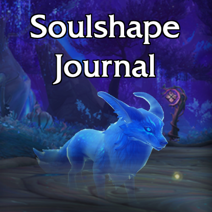

# Soulshape Journal

Adds a tab in the Collections Journal to track your soulshape collection and provides instructions to unlock new ones ([see what it looks like](.media/screenshot1.jpg))

## Features

* Displays all known soulshapes currently available for players in 9.2 with their 3D model.
* Automatically tracks every collected soulshape on any character.
* Detailed information on where and how to find every soulshape.
* Searchable and filterable list.
* Maps showing detailed location and instructions when needed.

## Installation

### Using Curse/Overwolf

Soulshape Journal has been [added to Curseforge](https://www.curseforge.com/wow/addons/soulshape-journal) and should be available from your Curse/Overwolf client.

### Using a third party client and Github

Most third-party clients allow installing addons directly from Github.

#### Ajour

Click "Install from an URL", paste `https://github.com/christopheml/soulshape-journal` and follow instructions. 
Ajour should pick up updates when they're published.

#### WowUp

Select "Get Addons", then on the top-right corner, click "Install from URL", paste `https://github.com/christopheml/soulshape-journal` and click "Import". 
WowUp should pick up updates when they're published.

### Manual installation from Github

* Click [Releases](https://github.com/christopheml/soulshape-journal/releases/) and from the latest release, click the `SoulshapeJournal-x.y.zip` link to download the zip file.
* Unzip the zip file into your retail Addons directory.
* Reload your UI if you were in-game.

## Licensing

The project is released under the [MIT License](LICENSE.txt).

## Reporting issues

If you find an bug or want to suggest a feature or enhancement, please create an issue on this repository. Github is the only channel I'll monitor for this purpose. 

Before you create an issue about a bug, make sure it hasn't already submitted before or not in the list below. Please attach any relevant information you have, including Lua stacktraces, steps you took to trigger the bug and the list of other addons you use (I would be extra kind to narrow down that list by reproducing the bug with other addons disabled, in case the bug is caused by an incompatibility between Soulshape Journal and another addon).

### Known issues

* Due to a difference in how both addons handle adding a tab to the Collections Journal frame, Soulshape Journal **is not compatible with iStableMaster**. This isn't something I can realistically change on my own and won't probably be fixed.

### Things I will probably not implement

This addon addresses Shadowlands specific content and isn't likely to see much use once the expansion is over (as opposed to e.g. a pet battle addon or an action bar addon), which
means I won't spend time on features that aren't trivial to develop and are not likely to be useful during the (relatively) short lifespan of Soulshape Journal.

Here's a list of things that were suggested or that I considered but I'm very unlikely to add for the reasons stated above:

* Organising and filtering soulshapes with custom tags
* Tutorial frames and tooltips to explain how to use the addon

## Translating Soulshape Journal

Available translations:

* :us:/:uk: English by Christophe Michel
* :fr: French  by Christophe Michel
* :ru: Russian by ZamestoTV
* :cn: Chinese (Simplified) by adavak
* :taiwan: Chinese (Traditional) by OwenFeline
* :de: German translation by covsoul
* :kr: Korean translation by chhanz

I'd like to thank all translators that made the addon more accessible for many people. You people rock!

### Note on translation correctness

I trust people sending me translations that they are correct. If anything is missing or wrong, please open an issue.

Note that translators are doing this on their own free time and cannot be expected to update translation immediatly after I release an update. The most up-to-date locale is always going to be the English one. Once again, if something's wrong with a translation, please open an issuee so it can get fixed as soon as possible. 

### How to contribute

If you want to contribute a new translation, please open a pull-request with the new translation added. 

The new locale file must contain all the keys from [enUS.lua](Localization/enUS.lua), which is the default locale. If a key doesn't need to be translated, set its value to `true`. If you need more information about how locales are handled in Soulshape Journal, please check [AceLocale's documentation](https://www.wowace.com/projects/ace3/pages/api/ace-locale-3-0?comment=1).

Your translation must be provided under a license compatible with the [MIT License](LICENSE.txt), ideally the MIT License itself, but some other copyleft licenses can work.

There is a [translation changelog](Localization/CHANGELOG-translations.md) intended to help you identify translations that have been added, removed or modified.

## Thanks and acknowledgements

This addon couldn't have been made without the help of the following people: 

* Marlamin for helping me identifying all the soulshape 3D models with [Wow Tools](https://wow.tools/).
* jaliborc for the [SecureTabs](https://github.com/Jaliborc/SecureTabs-2.0) lib that saved me a lot of time plugging the UI into the Collections Journal.
* RenataKane and everyone involved in the Wowhead community for the [Wowhead Soulshape Guide](https://fr.wowhead.com/guides/soulshapes-night-fae-covenant) that was the starting point for the information included in this addon.
* The people of [WowAce](https://www.wowace.com/) and [Ace3](https://www.wowace.com/projects/ace3) for the great scaffolding code.
* foxlit for the [Townlong Yak](https://www.townlong-yak.com/) tools.
* PigeonD at the *WoW Secret Finding & Collection* Discord for the Turkey Soul model info.
* All the people that provided feedback, enhancement suggestions, translations and so on, credited in the changelog.
